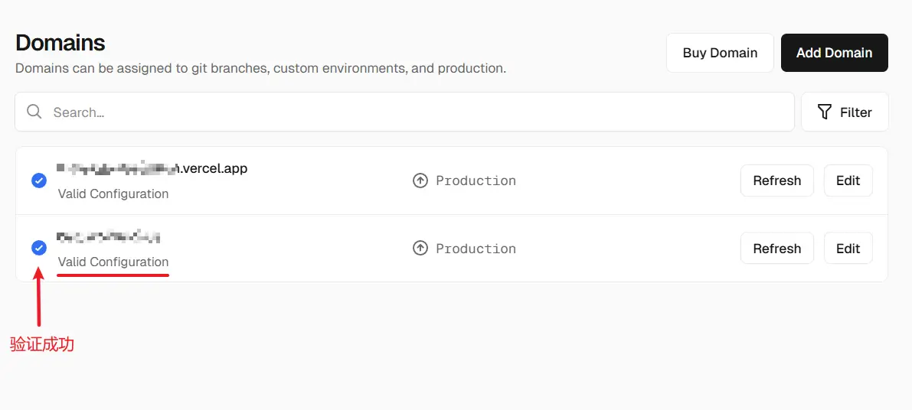
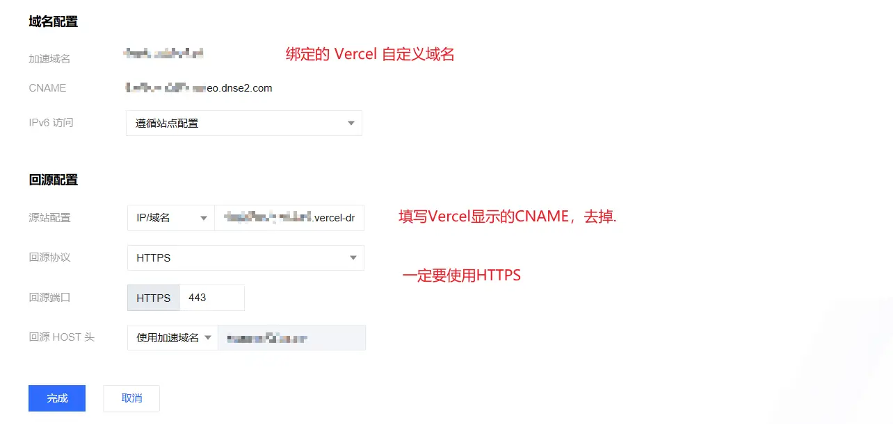

# 使用 EdgeOne 加速 Vercel

用 Vercel 部署项目确实很享受，只需要推送代码到仓库，剩下的都交给 Vercel 。不过，在国内的网络环境下，这份享受往往会打些折扣。由于 Vercel 没有国内节点，再加上国内 DNS 污染严重，用默认域名基本无法访问，即便绑定了自定义域名，访问速度也不理想。

刚好最近在用腾讯云的 EdgeOne (EO) 免费套餐，就想着能不能用 EO 给 Vercel 做加速，但是网上的教程讲的不是很清楚完整。配完还是懵逼的，借助 AI , 我大概搞明白了。如果有错误的地方，欢迎指正。

### 什么是 EdgeOne？

EdgeOne 是腾讯云出品的边缘安全加速平台，相比于传统的 CDN ，EO更像是一个全能的中间人。它直接在边缘节点处理安全过滤，同时利用腾讯优化的专线加速请求。

其加速流程大致如下：
`用户请求` -> `最近的 EdgeOne 边缘节点（国内/全球）` -> `腾讯云优化节点` -> `Vercel 节点服务器` -> `返回内容`

### 为 Vercel 配置自定义域名（必须）

想要通过 EdgeOne 加速 Vercel，必须先给 Vercel 项目绑定一个自定义域名。

这里涉及到一个关键的概念：**多租户架构（Multi-tenancy）**。你可以把 Vercel 想象成一栋巨大的共享公寓，成千上万个项目都住在同一个 IP 地址下。当请求到达 Vercel 的大门时，它必须通过请求头里的 `Host` 字段（也就是回源Host）来判断该把请求交给哪个房间。

也许你会想，那我直接使用默认域名（xxx.vercel.app）作为回源地址和回源host不就好了？很遗憾，这么配置后，访问加速域名会返回525/522错误码。对此，有些解释是说，Vercel 的默认域名指向的并不是项目真实的地址，而是 Vercel cdn 节点的地址。EdgeOne 无法解析这个地址，所以返回错误。

**具体步骤：**
1.  在 Vercel 项目面板点击右上角的 `Domains`，也可以点击 `Settings -> Domains`。进入域名管理页面。
2.  点击 `Add Domain` ，输入你的域名（如 `www.yourdomain.com`）并点击添加。
3.  **核心步骤**：Vercel 会提供一个 CNAME 目标（格式大概是这样 `xxxxxxxxx.vercel-dns-xxx.com.`）。记录下这个 CNAME，稍后会用得着。然后，你**必须**先去你的域名服务商那里，把域名的 DNS 记录指向这个 CNAME（** com 后面的.是需要保留的**）。
4.  **耐心等待**：当看到 Vercel 页面显示蓝色的对钩，而且域名下面显示 `Valid Configuration`，就可以继续下一步了。**只有看到这个蓝色标记，才能继续下一步。**

<!-- 插入Vercel 自定义域名配置图 -->

### 配置 EdgeOne

当 Vercel 验证通过后，我们就可以把 EdgeOne 接进来了。

在 EdgeOne 控制台添加站点并进入域名管理，添加你的加速域名(和你的自定义域名保持一致)：

*   **源站类型**：选择“域名/IP”。
*   **源站地址**：填入 Vercel 提供的 CNAME 地址（即刚才记录的 `xxxxxxxxx.vercel-dns-xxx.com.`，这次不需要包含最后的.）。
*   **回源协议**：**必须强制 HTTPS**。Vercel 出于安全考虑，不接受 80 端口的非加密回源，如果选了 HTTP，你会看到 502 错误。
*   **回源 Host**：填入你在 Vercel 验证通过的那个自定义域名。这是告诉 Vercel “我要找哪个项目”的关键。

配置生效后，最后去 DNS 服务商那里，把域名的 CNAME 修改为 **EdgeOne 提供的CNAME**，就完成了所有的配置。EdgeOne 的加速不一定立即生效，你可以访问加速域名试试。如果一切正常，你应该能看到 Vercel 项目的内容。

### 小记

切换到 EdgeOne 后，你会发现 Vercel 的展示又变成红色的警告了，显示 `Invalid Configuration`。

别担心，这是因为 Vercel 的自动化验证程序发现你的域名没有直接指向它。但实际上，只要 EdgeOne 带着正确的 `Host` 头去请求，Vercel 还是会正常返回数据。因为我们在切换前已经拿到了 Vercel 签发的 SSL 证书。

### 尾声

大功告成！现在你的 Vercel 项目已经被 EdgeOne 加速了。也许没快上多少，但是这种折腾的感觉，才是让人欲罢不能的。
